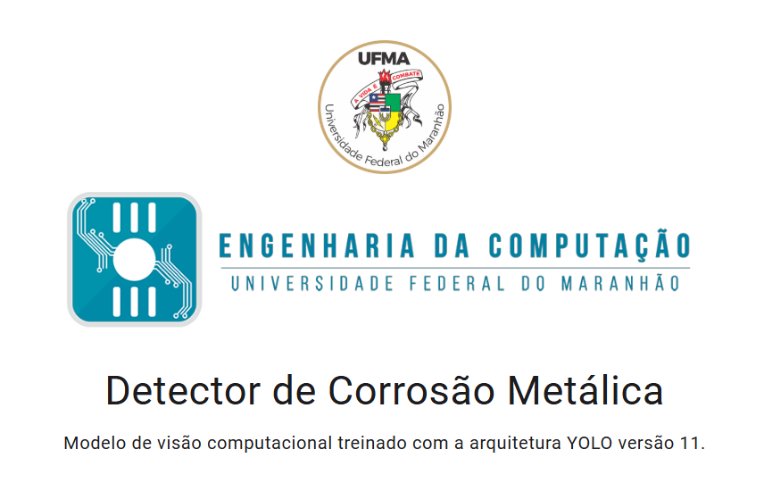

# Detector de Corrosão Metálica

    

    <a href="https://pdi-deteccao-corrosao-metalica.onrender.com/" target="_blank" style="text-decoration: none;">
        <button style="background-color: rgb(103, 80, 164); color: white; border: none; padding: 10px 20px; border-radius: 4px; font-size: 16px; cursor: pointer;">
            Clique aqui para visualizar a aplicação
        </button>
    </a>

## 📖 Sobre o Projeto

Esta aplicação é o resultado de um projeto desenvolvido por alunos da **Universidade Federal do Maranhão (UFMA)** no curso de **Engenharia de Computação** como parte da disciplina de **Processamento Digital de Imagens**, ministrada pelo professor **Haroldo Gomes**.

O objetivo principal do projeto é **detectar corrosão metálica** em imagens utilizando técnicas de **visão computacional** e **aprendizado de máquina**. Para isso, foi treinado um modelo baseado na arquitetura **YOLO versão 11**, oferecendo uma solução precisa e eficiente para identificação de áreas corroídas.

---

## 🛠️ Estrutura do Projeto

O projeto está organizado em três subpastas principais:

### 📁 `model`

Contém os códigos relacionados ao **treinamento do modelo** YOLOv11.

- Scripts para pré-processamento de dados
- Configurações de hiperparâmetros do modelo
- Treinamento e validação

### 📁 `detection-api`

Uma API em **Python** criada com **Flask**, responsável por expor o modelo treinado para teste.
**Principais funcionalidades**:

- Receber imagens para detecção.
- Retornar resultados contendo bounding boxes das áreas identificadas como corrosão.

### 📁 `web-app`

Uma **aplicação web** que roda o modelo diretamente no navegador utilizando **ONNX Runtime Web**.  
**Principais características**:

- Interface intuitiva para upload de imagens.
- Inferência em tempo real utilizando o modelo exportado em ONNX.
- Visualização dos resultados com bounding boxes destacando áreas de corrosão.

---

## 👥 Equipe de Desenvolvimento

| Nome                  | E-mail                           | Cargo                  | Imagem                                              |
| --------------------- | -------------------------------- | ---------------------- | --------------------------------------------------- |
| **Haroldo Gomes**     | haroldo.gbf@ufma.br              | Professor e Orientador |  |
| **Rodrigo de França** | rodrigo.menezes@discente.ufma.br | Aluno de Graduação     |        |
| **Leia Cardoso**      | leiacardoso21@gmail.com          | Aluno de Graduação     |               |

---

## 🚀 Tecnologias Utilizadas

O projeto foi desenvolvido com as seguintes tecnologias e ferramentas:

- **Visão Computacional**: Arquitetura YOLOv11 para detecção de corrosão.
- **Backend API**: Flask, para expor o modelo via endpoints.
- **Frontend Web**: Aplicação web baseada em React, Typescript com suporte ao ONNX Runtime.

---
